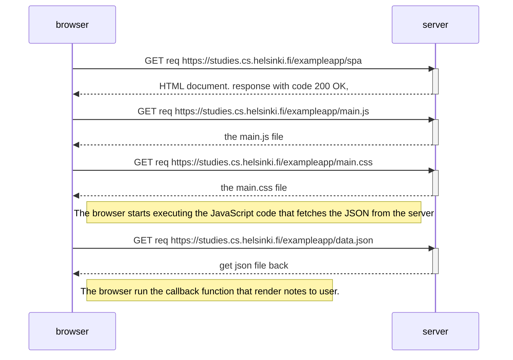

```mermaid
sequenceDiagram
    participant browser
    participant server

    browser ->> server: GET req https://studies.cs.helsinki.fi/exampleapp/spa
    activate server
    server -->> browser: HTML document. response with code 200 OK,
    deactivate server

    browser ->> server: GET req https://studies.cs.helsinki.fi/exampleapp/main.js
    activate server
    server -->> browser: the main.js file
    deactivate server

    browser ->> server: GET req https://studies.cs.helsinki.fi/exampleapp/main.css
    activate server
    server -->> browser: the main.css file
    deactivate server

    Note right of browser: The browser starts executing the JavaScript code that fetches the JSON from the server

    browser ->> server: GET req https://studies.cs.helsinki.fi/exampleapp/data.json
    activate server
    server -->> browser: get json file back
    deactivate server

    Note right of browser: The browser run the callback function that render notes to user.

```
