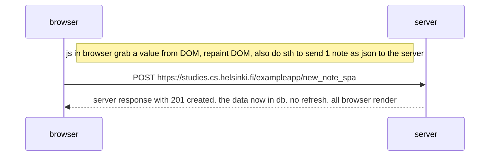

```mermaid
sequenceDiagram
    participant browser
    participant server


    Note right of browser: js in browser grab a value from DOM, repaint DOM, also do sth to send 1 note as json to the server

    browser->>server: POST  https://studies.cs.helsinki.fi/exampleapp/new_note_spa
    activate server
    server-->>browser: server response with 201 created. the data now in db. no refresh. all browser render

```
